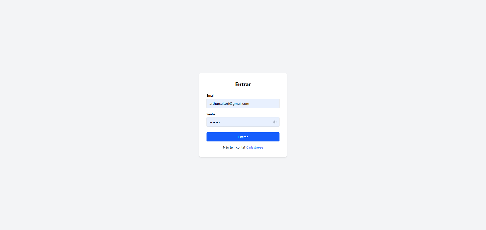
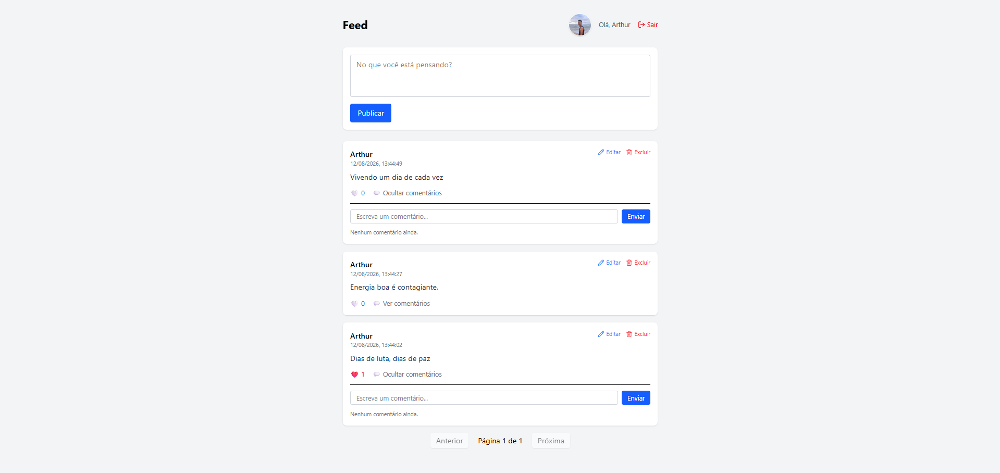
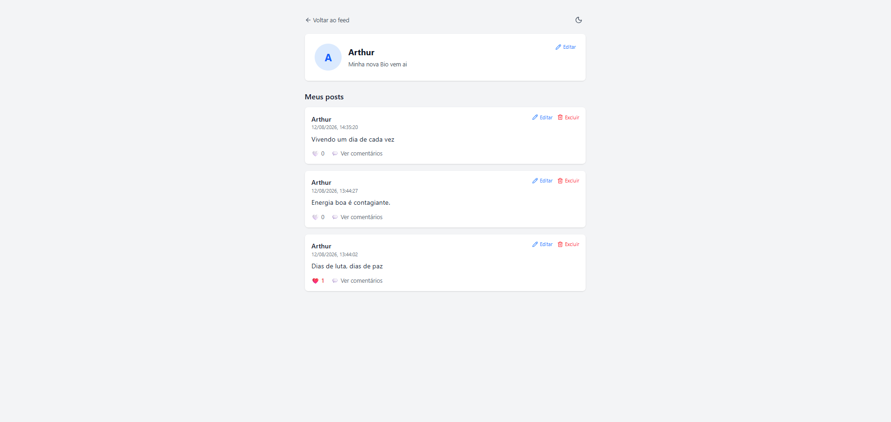
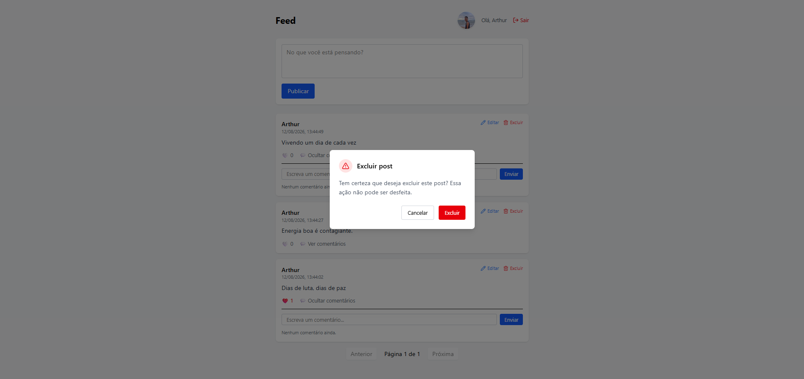
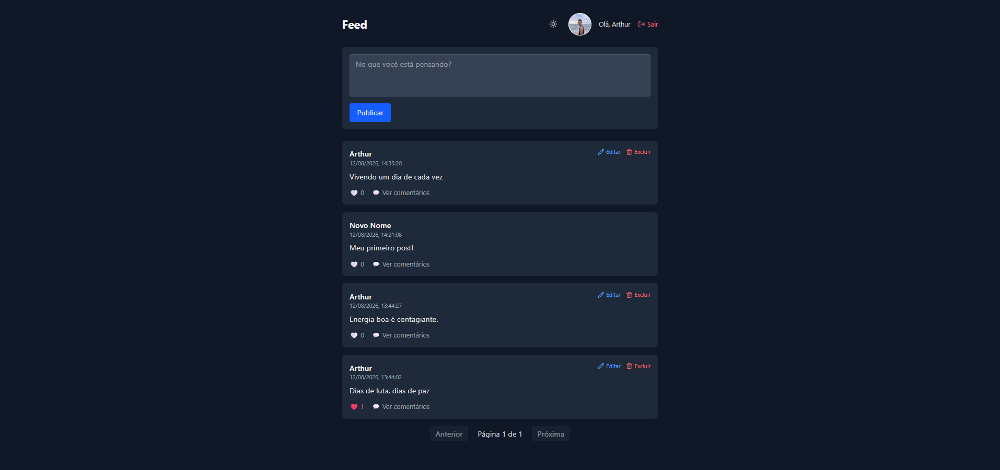

# Mini Rede Social — Front-end

Interface de uma rede social simples: feed de posts, curtidas, comentários, edição, perfis de usuário e dark mode, consumindo uma API própria. Projeto desenvolvido para prática e revisão de conceitos de front-end.

🔗 **Back-end deste projeto:** [mini-rede-social-api](https://github.com/ArthurSStante/mini-rede-social-api)

## 🚀 Deploy

> Em breve — deploy ainda não realizado.

## 📸 Screenshots

### Login


### Feed


### Perfil


### Modal Exclusao


### Dark mode


## 🛠️ Tecnologias

- React + Vite
- Tailwind CSS v4
- React Router
- Axios
- Lucide React (ícones)

## ✨ Funcionalidades

- Cadastro e login com autenticação JWT
- Feed com paginação
- Criar, editar e excluir posts
- Curtir posts (com animação)
- Comentar em posts
- Perfil de usuário: visualização de qualquer perfil e edição do próprio (nome/bio)
- Avatar de perfil (armazenado localmente no navegador)
- Dark mode com detecção automática da preferência do sistema + escolha manual persistente
- Modal de confirmação para ações destrutivas (excluir, sair)
- Loading skeletons durante carregamento
- Rotas protegidas (redireciona para login se não autenticado)

## 🔧 Como rodar localmente

```bash
git clone [LINK_DO_REPO_FRONT](https://github.com/ArthurSStante/mini-rede-social-front)
cd mini-rede-social-front

npm install

npm run dev
```

> ⚠️ É necessário que a API esteja rodando localmente na porta 5000 (ou ajustar a `baseURL` em `src/services/api.js`).

## 📌 Sobre o projeto

Este projeto foi desenvolvido como prática de revisão de conceitos de front-end com React, incluindo Context API para autenticação e temas globais, consumo de API REST com Axios, gerenciamento de estado, e componentização reutilizável.
